# Supplementary Experimental Results (Paper ID: [Your ID])

## 1. Task 1 Results (Random Initialization)

| Training Loss | Test Loss |
| :---: | :---: |
| 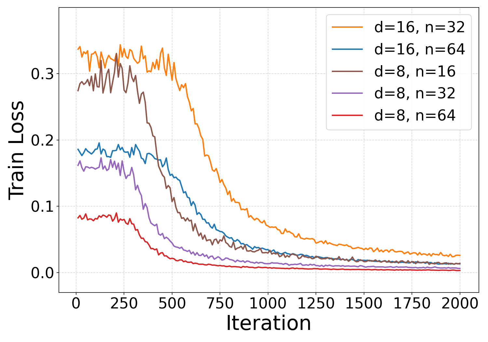 | 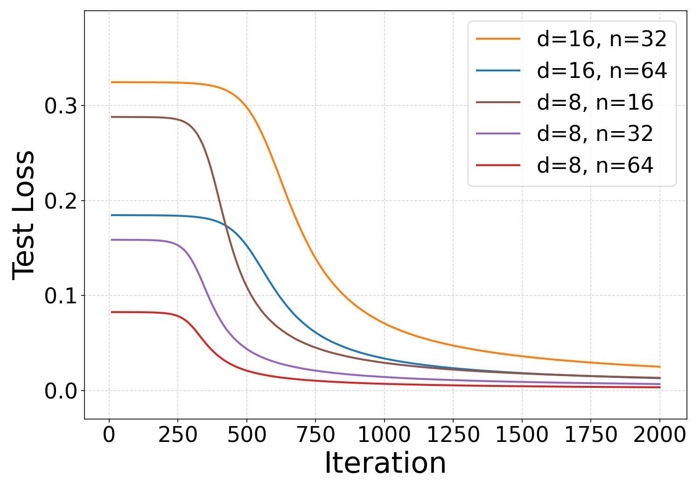 |
| *Fig 1: Task 1 Training Loss* | *Fig 2: Task 1 Test Loss* |

| Final V Matrix | Final W Matrix |
| :---: | :---: |
| 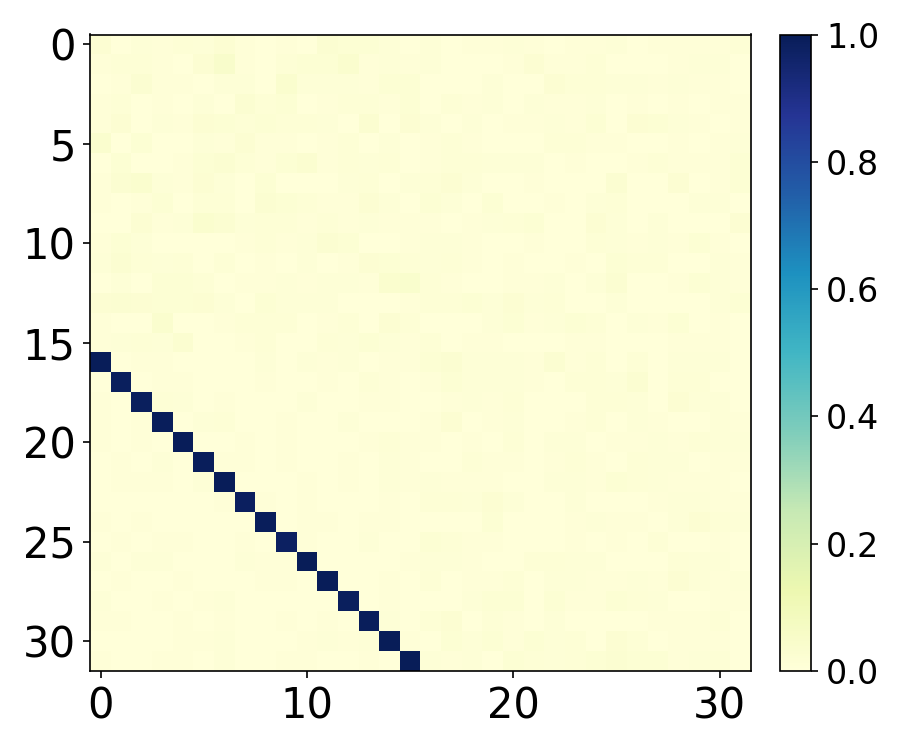 | 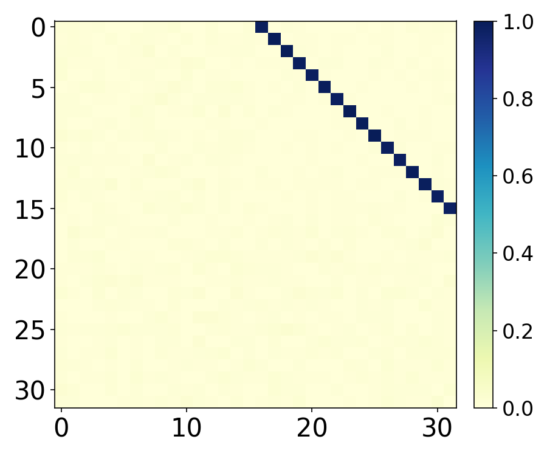 |
| *Fig 3: Task 1 V heatmap n=32, d=16* | *Fig 4: Task 1 W heatmap n=32, d=16* |

| Loop Error Comparison |
| :---: |
| 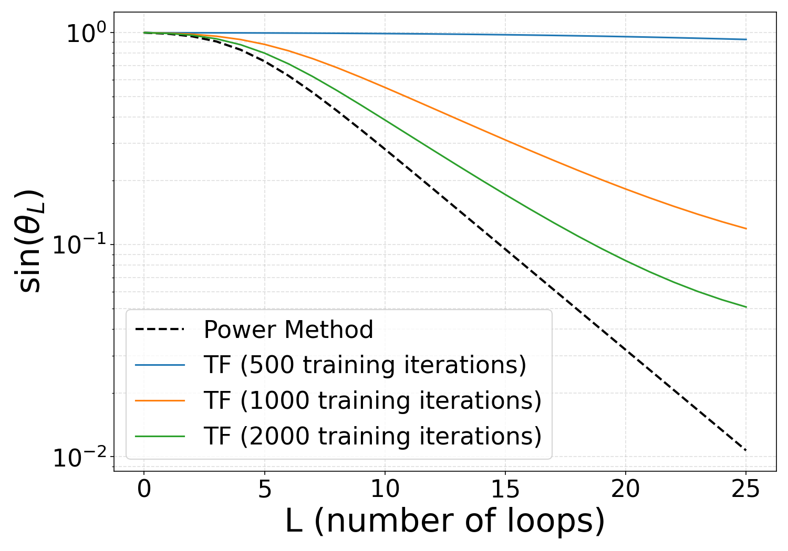 |
| *Fig 5: Task 1 Loop Error Analysis n=32, d=16* |

---

## 2. Task 2 Results (Random Initialization)

| Training Loss | Test Loss |
| :---: | :---: |
| 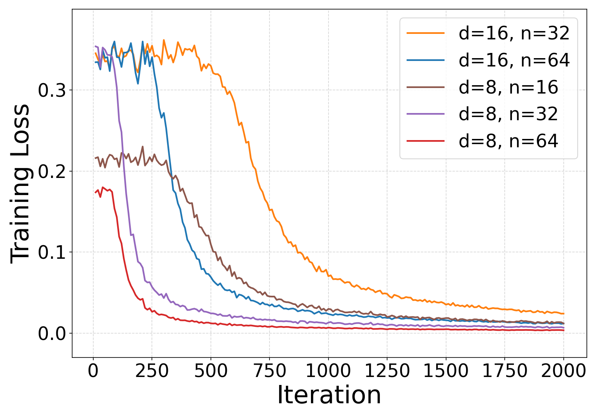 | 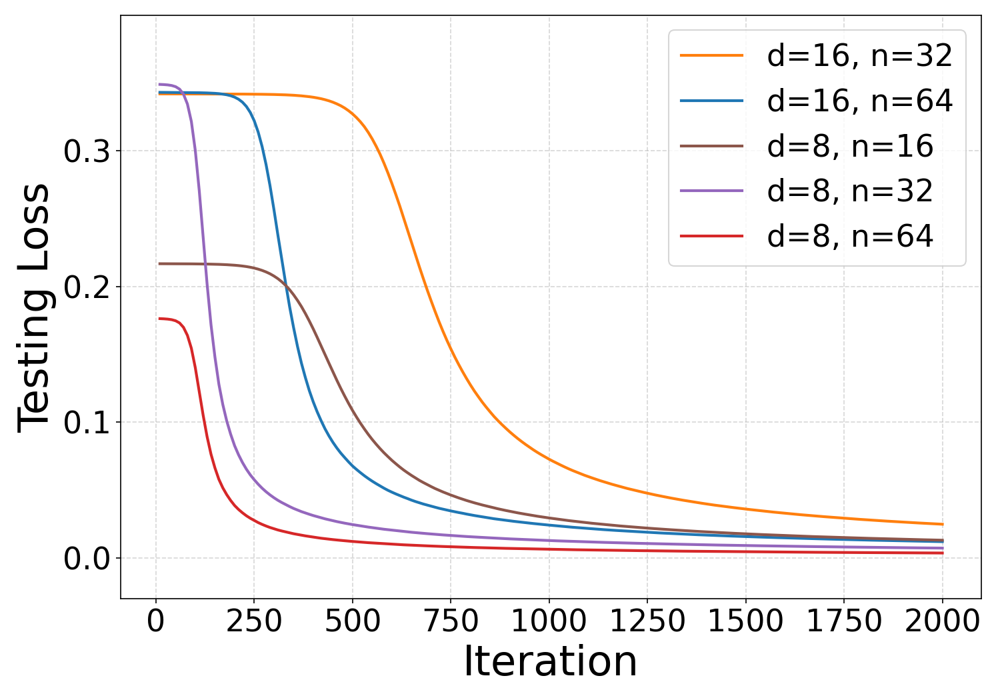 |
| *Fig 6: Task 2 Training Loss* | *Fig 7: Task 2 Test Loss* |

| Final V Matrix | Final W Matrix |
| :---: | :---: |
| 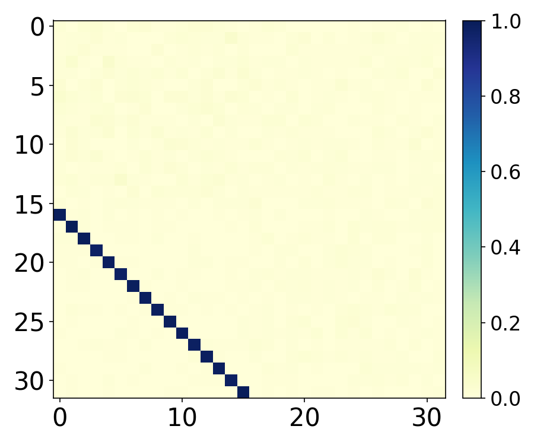 |  |
| *Fig 8: Task 2 V heatmap n=32, d=16* | *Fig 9: Task 2 W heatmap n=32, d=16* |

| Loop Error Comparison |
| :---: |
| 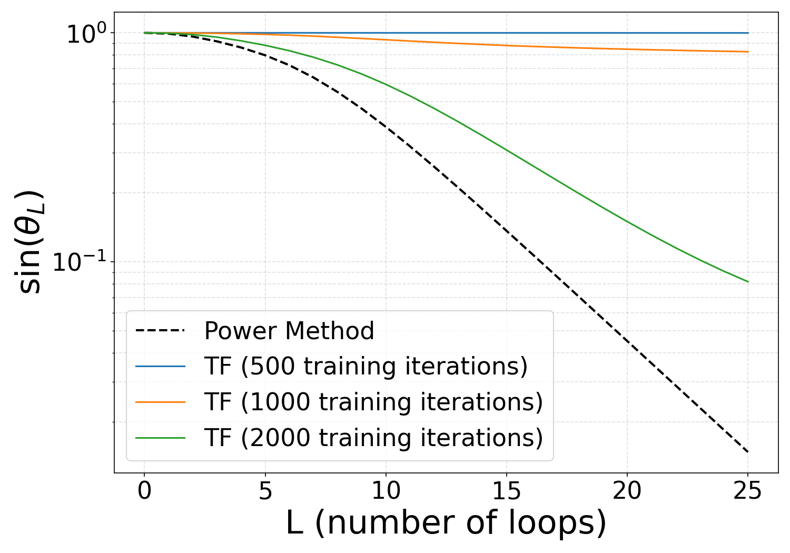 |
| *Fig 10: Task 2 Loop Error Analysis n=32, d=16* |

---

## 3. GPT-2 Architecture Results

| GPT-2 Architecute with LN, Training and Evaluation |
| :---: |
| 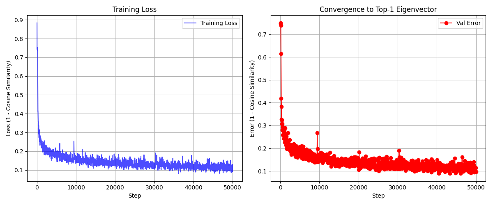 |
| *Fig 11: GPT-2 Architecute with LN, Training loss and Evaluation loss by cosine with top-1 eigenvector* |

| GPT-2 Architecute without LN, Training and Evaluation |
| :---: |
| 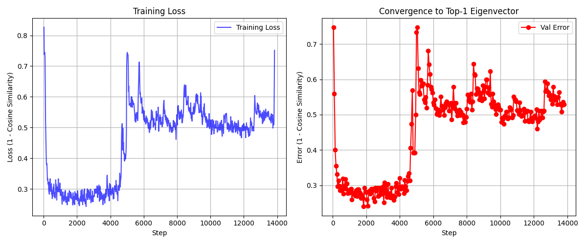 |
| *Fig 12: GPT-2 Architecute without LN, Training loss and Evaluation loss by cosine with top-1 eigenvector* |

---

## 4. Repeated five random results for Task 1

| Training Loss | Test Loss |
| :---: | :---: |
|  |  |
| *Fig 13: Task 2 Training Loss* | *Fig 14: Task 2 Test Loss* |
